# *Engagement Reward*
> "...quote"

## Technologies

**Token Multisender App 
**WooCommerce 

## Installation Guide

### Data Collection

#### Columbia Attention Token - EDA and Wrangling of Engagement Data from CU-FinTech Slack Channels

*About This Notebook...

This notebook contains code written for exploratory analysis and wrangling of data collected from the Slack communication channels of Columbia University FinTech program. The analysis began with the downloading and collection of raw data files in the .json format from Slack channels of interest (01-live-mw, 02-ask-the-class, 03-resources, and fintech) provided by the instructor. The Slack API is a good method for collecting this data, but without 'owner' or 'administrator' permissions, as a work-around, zip files previewed for sensitive information were requested. The raw data was parsed into folders according to the Slack channel of origin, then concatenated into a single DataFrame. With this step completed, assessment can begin. After assessment, some columns were selected to be dropped, as they did not pertain to the focus of the analysis. Once unnecessary columns are dropped, the process of cleaning the data begins. A series of cleaning functions were defined to carry out tasks such as filtering rows that have subtype values, datetime wrangling (which gives a breakdown of engagement traffic at various increments of time), extracting attachments and links, counting text length from posts and comments, and counting and identifying emojis used as reactions. The cleaning functions are then called and the cleaned DataFrame is reviewed. Once cleaning is accomplished, a function that carries out feature engineering is defined and called, giving us a cleaned and workable DataFrame for analysis of student, TA and instructor engagement with the Slack channels through the program's duration. The final step is to write this DataFrame into a .csv file for import into future notebooks.

#### Columbia Attention Token - Token Scoring System

This notebook begins by importing the .csv file containing the cleaned Slack data from the 'slack_eda_and_wrangling' notebook. After creating a DataFrame from the file and reviewing it, the groupby() function is applied to get an idea of total counts that represent cumulative participation. Considering these counts, two columns are added, both constructed from simple equations that give a better breakdown of engagement. The first is the user's "reply ratio," which takes the sum of the replies to a user's posts and divides that by the number of user's responsible for those replies. The next is a "token score," which uses the reply ratio as one of its variables, along with the sum of the text length of each user's posts, the sum of reactions each user contributed, and the sum of attachments each user provided in posts, all of which have been given a unique weighting. The result is the each user's unique "token score," which is used for the distribution of coins minted in our smart contracts.

*Remember:
- the 'text_length' column represents the total number of characters written in all posts by each user.
- the 'reply_count' column represents the total number of replies each user has gotten on their posts.
- the 'reply_users_count' column represents the total number of other users who replied to a user's posts.
- the 'attachments_true' column is a summed boolean representing the total number of times a post contained an attachment.
- the 'reactions_count' column represents the total number of reactions each user contributed.

---

*Token Scoring System:
- each character the user has written is worth 2 points.
- each attachment a user has contributed is worth 20 points.
- the user's "reply ratio" is multiplied by 200 points.
- each reaction a user has contributed is worth 5 points.

### Tokenization

Columbia Attention Token (CAT) is an ERC20 token created to reward student engagement in Fintech Bootcamp. 

*Contract ETH Ropsten
0x0d17E774A1bbDF3d8eb2cB5d1a6BF64692E0FDfF

*Initial Supply
200,000

*Ticker
CAT

---
Step 1: Deployed a simple ERC20 token on the Ethereum Ropsten Testnet
Minted 200,000 CAT tokens and stored in creator's wallet until transferred

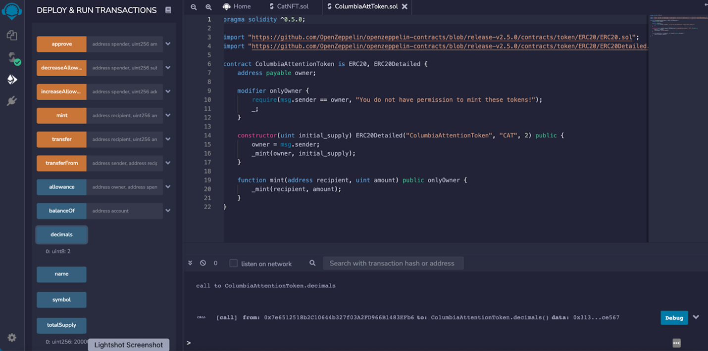

Step 2:  Provided liquidity with a CAT-ETH pair on Uniswap v3 on the Ropsten Testnet
I needed 3722 CAT to create the CAT-ETH pool, which I later increased to 5710 per ETH to stabilize the pair

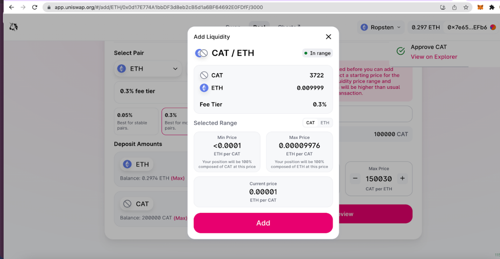

Step 3:  I ensured that that CAT was tradable on the exchange with a value of 43899.6 CAT per 1 ETH.  I did this so that CAT would not be too expensive to interact with
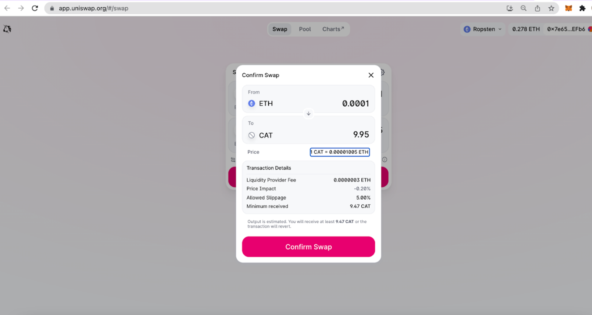
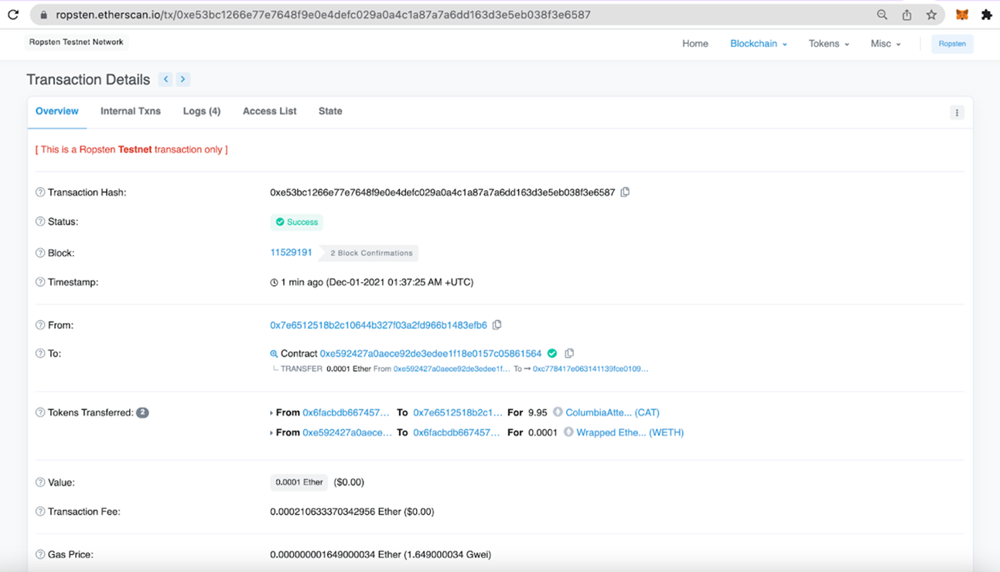
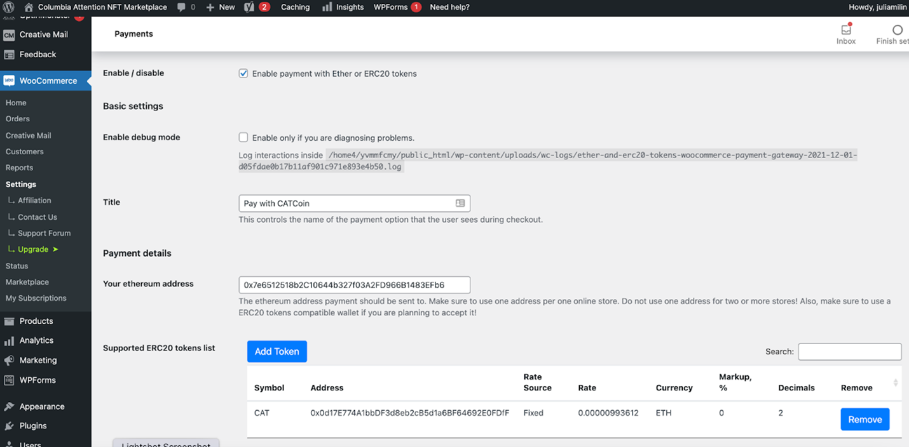

---

*Token transfer

MultiSender app for the airdrops of CAT tokens to the 6 winners
[multisender](https://multisender.app/)

---
### NFT Development

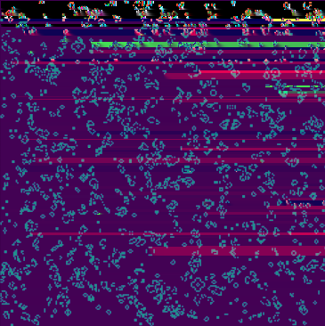
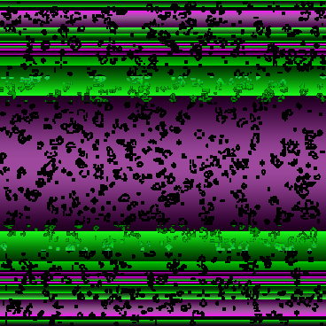
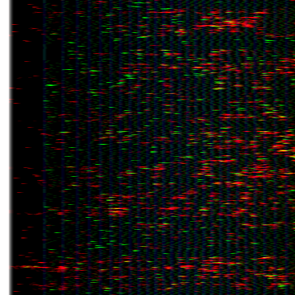

* NFT Contract
Smart contract, named NFT, inherits ERC721, ERC721URIStorage standards, import from OpenZeppelin.
Counters utility allows us to access & modify the unique asset identifier & increment it every time function is called.
SetTokenURI allows us to enter IPFS url as tokenURI

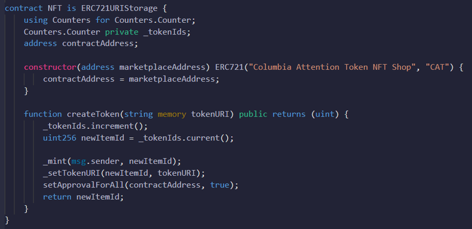

* Marketplace Contract
Smart contract, named NFTMarket, inherits ReentranctGuard standards, import from OpenZeppelin which is a modifier used for security measures to prevent reenty attacks when making recursive calls.
Contracts has functions that allows user to list digital assets for sale by creating a unique market item ID, transfer ownership when digital asset is purchased, and a recall function to return all unsold items, and to confirm NFT ownership of the same.

### Digital Asset Marketplace

User interface created using WooCommerce, an open-source e-commerce plugin for WordPress.
The WordPress plug-in allows for any WooCommerce product to be paid for using any ERC20 as long as liquidity is provided on an exchange like Uniswap.  
Both Uniswap and the plug-in support the Ropsten Testnet. The WordPress plug-in automatically interacts with the Web3 blockchain via Infura, allowing a seamless bridge from Web2 to Web3.  

[WordPress](https://wordpress.org/plugins/ethereumico/)

---

*Trade

Reward recipients must visit Columbia Attention Token Marketplace to purchase NFTs. After selecting from the NFTs listed for sale, buyer can simply click to pay with CAT and Metamask automatically launches for the confirmations.
Once order is confirmed, NFT will be sent to the buyer's address.

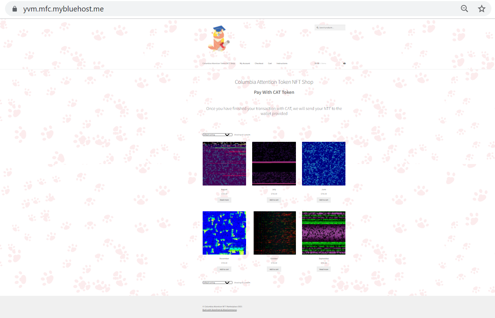
[marketplace frontend](https://yvm.mfc.mybluehost.me/) 
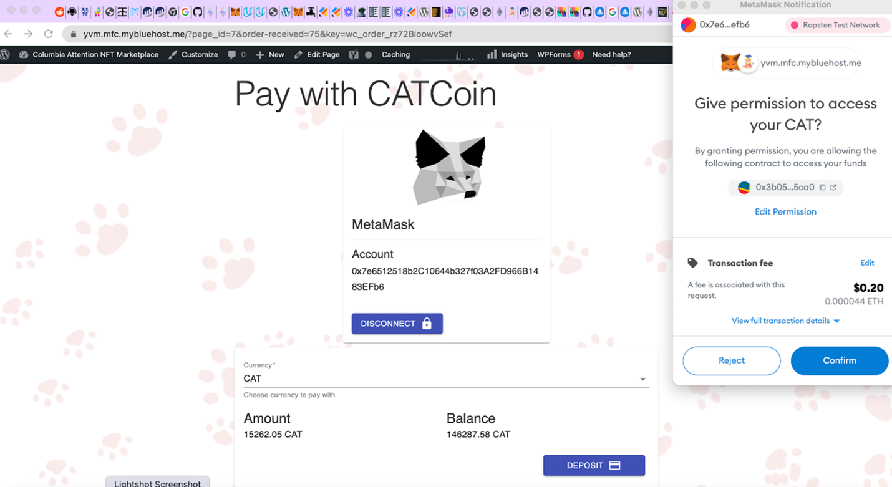

## Contributors

Pull requests are welcome. Please open an issue to discuss before executing any changes. Please make sure to update tests as needed.

## License

BSD-2-Clause https://opensource.org/licenses/BSD-2-Clause
